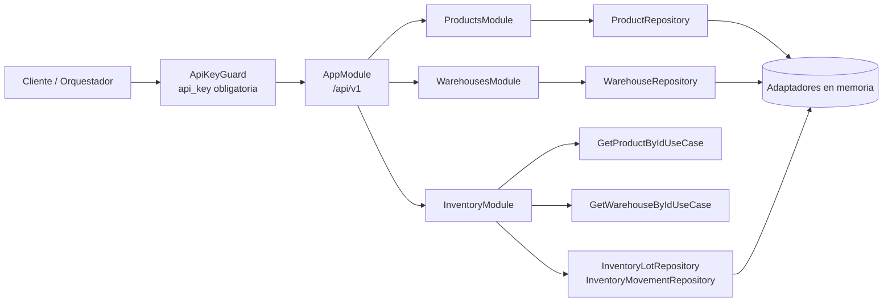

# Blueprint arquitectónico actual de `inventory-service`

## Resumen ejecutivo

`inventory-service` es un backend en **NestJS + TypeScript** que actualmente expone una API REST pública versionada bajo `\`/api/v1\``. La implementación sigue una variante de **Clean Architecture** orientada por módulos verticales (`products`, `warehouses`, `inventory`) y usa **adaptadores en memoria** como bootstrap temporal mientras se define la persistencia NoSQL definitiva.

## Stack y capacidades implementadas

- **Framework**: NestJS 11
- **Lenguaje**: TypeScript estricto
- **Documentación API**: Swagger + Scalar
- **Validación**: `class-validator` + `ValidationPipe`
- **Pruebas**: Jest + Supertest
- **Seguridad actual**: `ApiKeyGuard` global para `api_key`

## Diagrama de alto nivel

## Estructura por capas

### 1. `domain`
Responsabilidad: reglas de negocio puras, entidades, errores y puertos.

Ejemplos actuales:
- `src/modules/products/domain/entities/product.entity.ts`
- `src/modules/warehouses/domain/entities/warehouse.entity.ts`
- `src/modules/inventory/domain/entities/inventory-lot.entity.ts`
- `src/modules/inventory/domain/services/fifo-consumption.service.ts`

### 2. `application`
Responsabilidad: casos de uso explícitos, commands y coordinación entre dominio y puertos.

Ejemplos actuales:
- `CreateProductUseCase`
- `CreateWarehouseUseCase`
- `RegisterInventoryEntryUseCase`
- `RegisterInventoryExitUseCase`
- `GetProductInventoryAvailabilityUseCase`

### 3. `infrastructure`
Responsabilidad: adaptadores concretos. Actualmente se usan implementaciones **in-memory**.

Ejemplos actuales:
- `InMemoryProductRepository`
- `InMemoryWarehouseRepository`
- `InMemoryInventoryRepository`

### 4. `interfaces`
Responsabilidad: controladores HTTP, DTOs de transporte y mapeo request/response.

Ejemplos actuales:
- `ProductsController`
- `WarehousesController`
- `InventoryController`

## Módulos implementados

## `products`

### Propósito
Representa la identidad interna estable del producto, sus identificadores externos normalizados y sus referencias de imagen.

### Casos de uso ya implementados
- `CreateProductUseCase`
- `GetProductByIdUseCase`
- `ListProductsUseCase`
- `UpdateProductUseCase`
- `UpdateProductImagesUseCase`
- `SoftDeleteProductUseCase`

### Endpoints
- `POST /api/v1/products`
- `GET /api/v1/products`
- `GET /api/v1/products/{productId}`
- `PUT /api/v1/products/{productId}`
- `PUT /api/v1/products/{productId}/images`
- `GET /api/v1/products/{productId}/image-references`
- `DELETE /api/v1/products/{productId}`

## `warehouses`

### Propósito
Expone la identidad y configuración operativa del almacén, incluyendo `code`, `name`, `processingTimeDays` y `status`.

### Casos de uso ya implementados
- `CreateWarehouseUseCase`
- `GetWarehouseByIdUseCase`
- `ListWarehousesUseCase`
- `UpdateWarehouseUseCase`
- `SoftDeleteWarehouseUseCase`

### Endpoints
- `POST /api/v1/warehouses`
- `GET /api/v1/warehouses`
- `GET /api/v1/warehouses/{warehouseId}`
- `PUT /api/v1/warehouses/{warehouseId}`
- `DELETE /api/v1/warehouses/{warehouseId}`

## `inventory`

### Propósito
Modela el inventario como **movimientos + lotes FIFO**, no como un número mutable plano.

### Casos de uso ya implementados
- `RegisterInventoryEntryUseCase`
- `RegisterInventoryExitUseCase`
- `RegisterInventoryAdjustmentUseCase`
- `GetInventoryLotByIdUseCase`
- `GetProductInventoryLotsUseCase`
- `GetProductInventoryAvailabilityUseCase`
- `ListInventoryMovementsUseCase`

### Endpoints
- `POST /api/v1/inventory/entries`
- `POST /api/v1/inventory/exits`
- `POST /api/v1/inventory/adjustments`
- `GET /api/v1/inventory/lots/{lotId}`
- `GET /api/v1/inventory/products/{productId}`
- `GET /api/v1/inventory/products/{productId}/availability`
- `GET /api/v1/inventory/movements`

## Flujo HTTP transversal

1. El request entra por `\`/api/v1/**\``.
2. `ApiKeyGuard` valida el header `\`api_key\``.
3. `ValidationPipe` transforma y valida DTOs.
4. El controller permanece delgado y delega a un caso de uso.
5. El caso de uso coordina entidades y puertos.
6. El adaptador concreto persiste/recupera el estado.
7. La respuesta vuelve en envelope `\`data\`` + `\`meta\``.

## Decisiones relevantes vigentes

- La API pública está **versionada desde el inicio**.
- La seguridad mínima obligatoria es por `api_key` técnica.
- `DELETE` en `products` y `warehouses` se comporta como **soft delete**.
- `inventory` expone operaciones con semántica explícita: `entries`, `exits`, `adjustments`.
- Los repositorios actuales son en memoria para permitir avanzar la API mientras se define la capa NoSQL.

## Cómo se debe seguir expandiendo

### Sustituir persistencia en memoria por NoSQL
Mantener exactamente el mismo contrato de puertos:
- `ProductRepository`
- `WarehouseRepository`
- `InventoryLotRepository`
- `InventoryMovementRepository`

Solo se debe cambiar la implementación en `infrastructure`, sin filtrar documentos crudos al resto de capas.

### Agregar nuevos endpoints
Si el endpoint es de dominio:
1. crear DTO request/response,
2. crear command/query,
3. crear caso de uso,
4. extender controller,
5. agregar pruebas unitarias/e2e,
6. documentar el cambio y actualizar ADRs si la decisión es arquitectónica.

## Riesgos y pendientes

- Falta persistencia real NoSQL.
- Aún no existe filtro global uniforme para mapear todos los errores de dominio.
- No hay autenticación de usuario/rol; solo protección técnica por header.
- La integración con orquestadores todavía no está implementada como adaptador real.

## Señales de que la arquitectura se mantiene sana

- Los controllers siguen delgados.
- Los casos de uso no dependen de NestJS HTTP.
- Los puertos separan la aplicación de la infraestructura.
- `inventory` resuelve FIFO desde dominio, no desde controladores ni DTOs.
